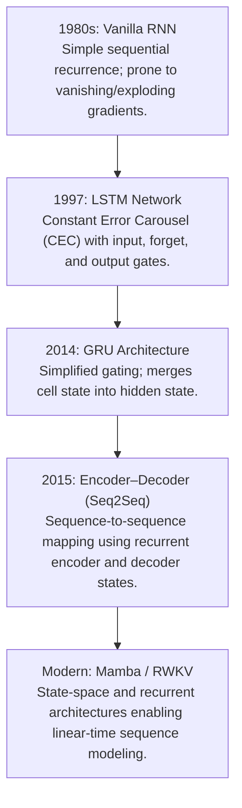

# Awesome-Recurrent-Neural-Networks 🧠🔄

<meta name="description" content="A comprehensive reference guide and curated collection of Recurrent Neural Networks (RNNs)—mapping mathematical foundations, LSTM, GRU, Mamba, and PyTorch implementations.">

<p align="center">
  
</p>

<p align="center">
  <a href="https://github.com/ishandutta2007/Awesome-Awesome-Awesome"></a><a href="https://discord.gg/jc4xtF58Ve"></a>
</p>

## 🔄 The Recurrent Neural Network (RNN) Architecture Map

> **A comprehensive reference guide for Recurrent Neural Networks (RNNs)—mapping their core mathematical foundations, architectural evolutions, optimization bottlenecks, and modern extensions.** 📚

Recurrent Neural Networks revolutionized deep learning by introducing sequential memory processing. By feeding the output of a hidden state back into itself as the input for the next time step, RNNs broke the constraint of static, fixed-size vector inputs, enabling the modeling of time-series data, natural language, and sequential waveforms.

---

## 📅 The Evolutionary Timeline

The architectural transition from basic hidden state feedback loops to specialized gated systems, and ultimately to parallelized self-attention foundation networks.



---

## 🧭 Deep Dive: Architectural Precursors & Variations 🔬

### 1. Vanilla Recurrent Neural Networks (Elman & Jordan Networks) 🍦
The earliest implementations of recurrence introduced an internal feedback loop into standard feedforward architectures.
*   **The Mechanism:** The hidden layer activations from time step t-1 are saved in a temporary layer (often called context units) and fed back into the hidden layer at time step t along with the current input vector.
*   **Mathematical Form:** 
    \[h_t = \tanh(W_{hh} h_{t-1} + W_{xh} x_t + b_h)\]
    \[y_t = \text{softmax}(W_{hy} h_t + b_y)\]
*   **Limitation:** The **Vanishing and Exploding Gradient Problem**. During Backpropagation Through Time (BPTT), gradients are repeatedly multiplied by the weight matrix \(W_{hh}\). If eigenvalues of \(W_{hh}\) are less than 1, the gradient shrinks exponentially to zero; if greater than 1, it blows up to infinity. This prevents vanilla RNNs from capturing long-term dependencies beyond 10–20 time steps.

### 2. Long Short-Term Memory (LSTM) (1997) 💾
Sepp Hochreiter and Jürgen Schmidhuber solved the vanishing gradient problem by replacing the simple hidden layer node with a complex structural unit called an **LSTM Cell**.
*   **The Innovation:** Introduced a separate, parallel highway called the **Cell State (\(C_t\))** that allows information to flow across thousands of time steps with minimal mathematical distortion. 
*   **Gating Infrastructure:**
    *   *Forget Gate (\(f_t\)):* Determines how much of the old long-term memory to throw away.
    *   *Input Gate (\(i_t\)):* Determines what new information from the current input to store in the cell state.
    *   *Output Gate (\(o_t\)):* Controls what parts of the updated cell state are surfaced to update the current visible hidden state (\(h_t\)).
*   **Impact:** Became the industry backbone for speech recognition, machine translation, and text-to-speech for over two decades.

### 3. Gated Recurrent Unit (GRU) (2014) 🎛️
Kyunghyun Cho et al. streamlined the heavy design of the LSTM cell to reduce its parameter footprint and computation overhead.
*   **The Innovation:** Eliminated the separate cell state entirely, tracking all long-term and short-term trends inside a single unified **Hidden State (\(h_t\))**.
*   **Gating Infrastructure:**
    *   *Reset Gate (\(r_t\)):* Determines how to combine the new input with the previous hidden state memory.
    *   *Update Gate (\(z_t\)):* Acts simultaneously as a forget gate and an input gate, deciding how much old memory to keep versus how much new content to ingest.
*   **Impact:** Provided identical empirical performance to LSTMs on most sequence benchmarks while training up to 20% faster due to fewer parameter matrices.

### 4. Modern Linear Recurrence: Mamba & RWKV (2023–2026 Era) ⚡
While Transformers replaced LSTMs due to parallel training efficiency, modern architectures have rediscovered recurrence to avoid the heavy memory costs of the Transformer's O(N²) KV-cache.
*   **The Innovation:** Modern State Space Models (SSMs) like **Mamba** and linear recurrence models like **RWKV** utilize time-varying, data-dependent recurrence formulas that can be mathematically unrolled into highly efficient parallel associative scans during training.
*   **Impact:** Offers the linear computational scaling of classical RNNs at inference time (O(1) state updates per token) while retaining the massive parallel training capabilities and expressiveness of traditional Transformers.

---

## 🧮 Backpropagation Through Time (BPTT) Mechanics 📉

To train an RNN, the cyclic graph must be unrolled across the entire temporal length of the sequence, transforming the recurrent network into a deep feedforward network with shared weights across each vertical slice.

```text
Unrolled Graph:

   x_[t-1]          x_[t]          x_[t+1]
      │               │               │
      ▼               ▼               ▼
┌───────────┐   ┌───────────┐   ┌───────────┐
│           │─► │           │─► │           │
│  h_[t-1]  │   │   h_[t]   │   │  h_[t+1]  │
│           │   │           │   │           │
└───────────┘   └───────────┘   └───────────┘
      │               │               │
      ▼               ▼               ▼
   y_[t-1]          y_[t]          y_[t+1]
```

### The Optimization Cost
The overall error gradient across the sequence is accumulated by calculating partial derivatives at each time step and propagating errors backwards through the sequence chains:

$`[\frac{\partial L}{\partial W} = \sum_{t=1}^{T} \sum_{k=1}^{t} \frac{\partial L_t}{\partial y_t} \frac{\partial y_t}{\partial h_t} \left( \prod_{j=k+1}^{t} \frac{\partial h_j}{\partial h_{j-1}} \right) \frac{\partial h_k}{\partial W}\]`$

The product term \(\prod_{j=k+1}^{t} \frac{\partial h_j}{\partial h_{j-1}}\) is the exact mathematical driver of the vanishing gradient flaw, as it forces sequential multiplication of hidden-state Jacobian matrices.

---

## 🎛️ Feature Comparison Matrix 📊

| Metric | Vanilla RNN | LSTM | GRU | Mamba (Modern SSM) |
| :--- | :--- | :--- | :--- | :--- |
| **Gating Operations** | None | 3 Gates (i, o, f) | 2 Gates (r, z) | Continuous Selection Scan |
| **Memory Tracking** | Hidden State (h) | Cell (C) & Hidden (h) | Hidden State (h) | Latent State Space Matrix |
| **Training Speed** | Fast (Sequential) | Slow (Sequential) | Moderate (Sequential)| Extremely Fast (Parallelized)|
| **Effective Context** | Short (< 20 tokens) | Long (~1k tokens) | Long (~1k tokens) | Near-Infinite (O(N) scaling) |

---

## 🚀 Real-World Applications by Sequence Topology 🌐

Recurrent networks are modular and can be wired into different structural shapes depending on the input and output dimensions of the task:

- ### 1. One-to-Many Architecture
	*   **Structure:** A single static input token maps to an unpredictable chain sequence of outputs.
	*   **Application:** *Image Captioning* (Inputting a static matrix of pixels from a CNN → Generating a dynamic sequential text description sentence).

- ### 2. Many-to-One Architecture
	*   **Structure:** An incoming string sequence of tokens is processed down to a single output categorization vector.
	*   **Application:** *Sentiment Analysis* or *Time-Series Classification* (Processing a sequence of 500 financial transactions → Emitting a single risk-probability percentage).

- ### 3. Many-to-Many Architecture (Synchronous)
	*   **Structure:** Every sequential input frame has an immediate, concurrent output frame.
	*   **Application:** *Video Frame Segmentation* or *POS Tagging* (Labeling every single spoken word in an audio sequence with its grammatical classification frame-by-frame).

- ### 4. Many-to-Many Architecture (Asynchronous / Seq2Seq)
	*   **Structure:** An encoder RNN consumes the entire input sequence to build a dense thought vector, then passes it to a decoder RNN which unrolls the output sequence.
	*   **Application:** *Machine Translation* (Reading an entire French paragraph → Computing a compressed vector context → Synthesizing the equivalent English paragraph).

---

## 💻 Baseline PyTorch Implementation: LSTM Sequence Predictor 🐍

```python
import torch
import torch.nn as nn

class LSTMClassifier(nn.Module):
    def __init__(self, vocab_size, embedding_dim, hidden_dim, output_dim):
        super(LSTMClassifier, self).__init__()
        # 1. Map discrete tokens to dense vector sequences
        self.embedding = nn.Embedding(vocab_size, embedding_dim)
        
        # 2. Main structural sequence engine
        self.lstm = nn.LSTM(
            input_size=embedding_dim,
            hidden_size=hidden_dim,
            num_layers=2,
            batch_first=True,
            dropout=0.2
        )
        
        # 3. Project the final hidden state to target class distribution
        self.fc = nn.Linear(hidden_dim, output_dim)
        
    def forward(self, x):
        # x shape: (batch_size, sequence_length)
        embedded = self.embedding(x) # shape: (batch_size, sequence_length, embedding_dim)
        
        # out shape: (batch_size, sequence_length, hidden_dim)
        # h_n shape: (num_layers, batch_size, hidden_dim) - Last hidden state
        out, (h_n, c_n) = self.lstm(embedded)
        
        # Pull out the final temporal step's hidden state
        final_step_hidden = out[:, -1, :] # shape: (batch_size, hidden_dim)
        
        return self.fc(final_step_hidden)
```


